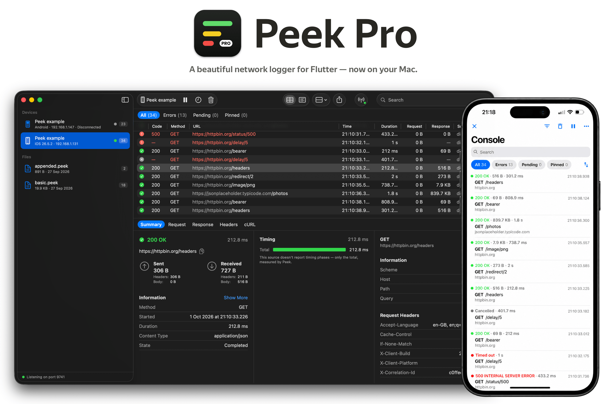
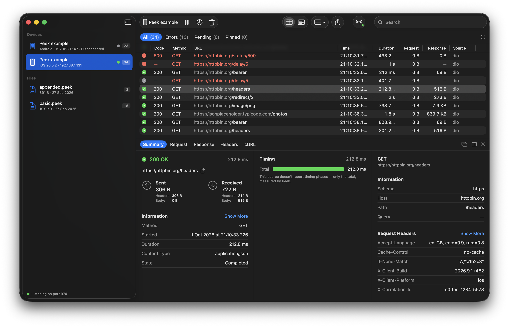
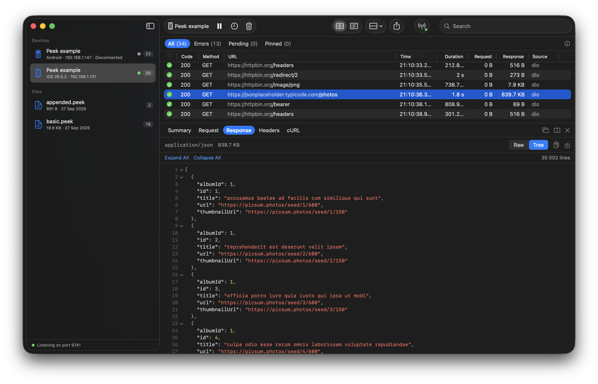
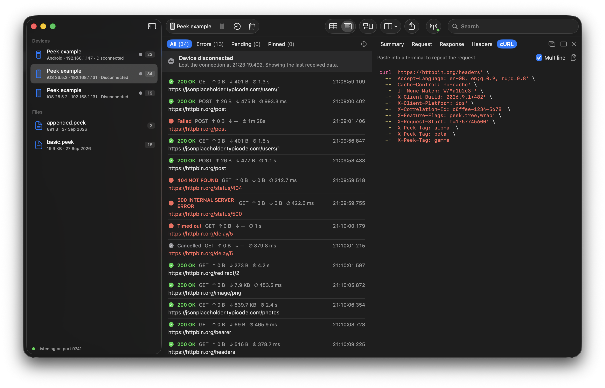

<p align="center">
  
</p>

<p align="center">
  <a href="https://github.com/artdima/peek-pro/actions/workflows/ci.yml"></a>
  
  
  <a href="LICENSE"></a>
  <a href="https://github.com/artdima/peek-pro/releases/latest"></a>
</p>

---

**What Peek Pro is.** A native macOS app for the network calls that
[Peek](https://github.com/artdima/peek) records in a Flutter app. Peek is
the inspector that lives inside the app; Peek Pro is its companion on the
desk: the same calls, live from a phone, a simulator or an emulator, or from
a `.peek` file someone saved — with a bigger screen, a real table, search
across everything and several apps at once.

**What it is not.** A proxy. Nothing goes through Peek Pro on its way to the
server, no certificate is installed and no traffic is rewritten. It shows
what Peek already recorded inside the app, after the app's own redaction.

**Inspired by Pulse Pro.** Peek Pro is inspired by
[Pulse Pro](https://github.com/kean/Pulse), the desktop viewer for Pulse. It
is an independent app, written from scratch in SwiftUI for the Peek
ecosystem.

## A look around

**The console.** Every call in a table — status, method, URL, time,
duration, sizes, source — with the selected one summed up below: the
outcome, the timing, what was sent and received, the headers.

<p align="center">
  
</p>

**Bodies.** A JSON body as a tree to fold or as raw text, with line
numbers, however long it is. A large body stays on the device until you open
it, so a busy app does not flood the network with downloads nobody reads.

<p align="center">
  
</p>

**The list, and the call beside it.** The list reads like Peek on the phone;
the details can sit next to it — here a call ready to paste into a terminal.
A device that goes away leaves its calls behind, to read, save and export.

<p align="center">
  
</p>

## Features

- **Live from the device.** An app with
  [`peek_remote`](https://github.com/artdima/peek/tree/main/packages/peek_remote)
  streams its calls over the local network. Each run is a session in the
  sidebar; several devices and apps can stream at once, and a device that
  reconnects comes back to its own session with its history.
- **Pair once with a code.** Peek Pro shows four digits; a person types them
  into the app on the phone, and the device is remembered from then on.
  Peek Pro announces itself over Bonjour, so the app lists the Mac by name.
  A long token is there for CI, where nobody types.
- **Find the call.** Search, filters, the All, Errors, Pending and Pinned
  modes, sorting and grouping, issues and insights at a glance, pins for the
  calls worth keeping. Smooth at a hundred thousand calls.
- **Every detail.** The summary with timing and sizes; the request and the
  response with their headers, cookies, query and body — JSON, text, images
  and the rest; the error behind a failure; the call as cURL. Any call opens
  in a window of its own.
- **Files.** `.peek` files open from Finder; a live session saves as one,
  for a bug report or a colleague. Export as HAR, cURL, Markdown or text.

## Installing

Download `Peek-Pro-<version>.dmg` from the
[latest release](https://github.com/artdima/peek-pro/releases/latest), open
it and drag Peek Pro to Applications. It needs macOS 26 or later, and it is
signed with Developer ID and notarized by Apple.

## Connecting an app

In the Flutter app, add `peek_remote` and start it in debug builds:

```yaml
dependencies:
  peek_remote: ^2.0.0
```

```dart
if (kDebugMode) {
  peek.attach(PeekRemote(peek)..start());
}
```

Then start Peek Pro, and in the app open Peek → **⋯** → **Connect to Peek
Pro**, pick the Mac or type its address, and enter the code Peek Pro shows.
That is all the code there is: the next launch reconnects on its own.

| The app runs on | Address |
| --- | --- |
| The iOS Simulator | `localhost` |
| An iPhone or iPad | The Mac's address, on the same Wi-Fi — even on a cable |
| The Android emulator | `10.0.2.2` |
| An Android phone | The Mac's address on the same Wi-Fi, or `localhost` after `adb reverse tcp:9741 tcp:9741` |

Peek Pro shows its addresses and the code in its window and in
Settings → Connection. [Remote viewing](https://github.com/artdima/peek/blob/main/doc/remote.md)
in Peek's documentation is the whole guide: setting up, security, what never
leaves the device, and what to do when it does not connect.

## Building from source

Peek Pro needs macOS 26 or later and Xcode 26:

```sh
git clone https://github.com/artdima/peek-pro.git
cd peek-pro
open "Peek Pro.xcodeproj"
```

Or from the command line:

```sh
xcodebuild -project "Peek Pro.xcodeproj" -scheme "Peek Pro" -destination 'platform=macOS' build
xcodebuild -project "Peek Pro.xcodeproj" -scheme "Peek Pro" -destination 'platform=macOS' test
```

Peek Pro reads the `.peek` format and the remote protocol from Peek's
specifications, not from its Dart code. Their reference files are copied
into the tests, with the Peek commit they came from; with Peek checked out
next to this repository, `scripts/sync-peek-spec.sh` brings them up to date
(`PEEK_DIR` points elsewhere).

A release — the app signed with Developer ID and notarized, in a DMG — comes
from `scripts/release.sh`; what it needs is in the script's header.

## Related

- [Peek](https://github.com/artdima/peek) — the in-app network inspector for
  Flutter, and the packages around it.
- [The session format](https://github.com/artdima/peek/blob/main/doc/spec/session-format.md)
  and [the remote protocol](https://github.com/artdima/peek/blob/main/doc/spec/remote-protocol.md)
  — everything another viewer would need.

## License

MIT © 2026 Dmitriy Medyannik — see [LICENSE](LICENSE).
